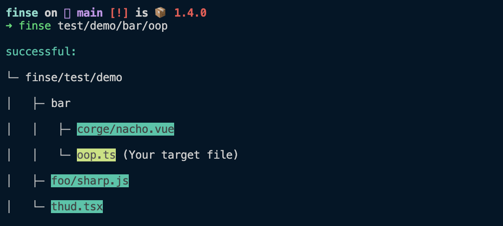

<p align="center">
    
</p>

## finse

Find which files reference the target file

### Features

* Friendly output
* Supports alias via `tsconfig.json`
* Supports `esm` and `cjs`
* Detect the project root directory
* Unlimited file types

### Install

```shell
$ npm i -g finse
$ finse -h # help
```

### Usage

Suppose we have a project, its directory structure is like this：

```txt
finse
  └─ test
      └─ demo
          ├─ bar
              ├─ corge
                  └─ nacho.vue
              └─ oop.ts
          ├─ foo
              └─ sharp.js # sdf
          └─ thud.tsx
```

And you want to find out which files reference `oop.ts`，just run：

```shell
$ finse text/demo/bar/oop.ts
```

Maybe you will see the output similar to this:

<p align="center">
  
</p>

The yellow background represents the file you want to match, the cyan background is the file that "uses" it

### API

**--root [rootname]**

* Specify the project root directory

**--expand**

* Expand collapsed file tree

**--link**

* Display the absolute path of the file. That way other files can be accessed directly through the terminal

**--ignore**

* Ignore file does not exist errors

### Motivation

* It's hard to find which other files use the target file

* Search in IDEA is not enough, it's difficult to give exact search keywords

### How is works ?

* First, it will detect the project root directory if no directory is specified
* By default, the directory where `package.json` is located is selected as the root directory
* Next, all reasonable files in the directory will be scanned
* Then match the contents of the file to see if there is an import statement
* `finse` will recognize the following imports

```js
// static import
import xx from 'xxx'

if (Math.random() > 0.5) {
  // dynamic import
  import('xx.ts')
}

// require import
require('./xx/xx')
```

`finse` works with regular expressions, But don't worry about "accidental recognition":

```js
// Yes, legal import
import xx from 'xxx'

// No，Imports in comments are not recognized
// comment: import xx from 'xxx'
```

And supports identifying paths with alias:

```html
<script setup>
import xx from '@/xx'
// or:
import xxx from '~/xx'
</script>
```

But have to make sure there is such a configuration in `tsconfig.json`:

```json
{
  "compilerOptions": {
    "paths": {
      "~/*": ["test/demo/bar/*"]
      "@/*": ["src/*"]
    }
  }
}
```

### finse

it's mean find use