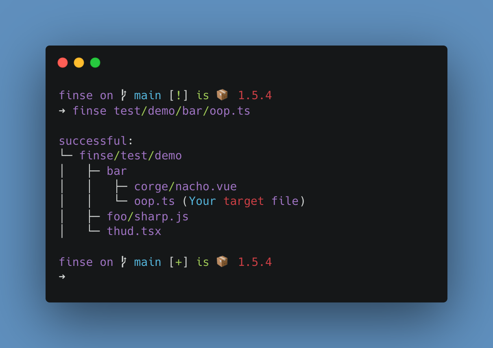

<p align="center">
    
</p>

## finse

Find which files reference the target file

### Features

* Friendly output
* Supports alias via `tsconfig.json`
* Supports `esm` and `cjs`
* Detect the project root directory
* Unlimited file types

### Install

```shell
$ npm i -g finse
$ finse -h # help
```

### Usage

Suppose we have a project，such as：

```txt
finse
  └─ test
      └─ demo
          ├─ bar
              ├─ corge
                  └─ nacho.vue
              └─ oop.ts
          ├─ foo
              └─ sharp.js # sdf
          └─ thud.tsx
```

And you want to find out which files reference `oop.ts`，just run：

```shell
$ finse text/demo/bar/oop.ts
```

<p align="center">
  
</p>

### API

**--root [rootname]**

* Specify the project root directory

**--expand**

* Expand collapsed file tree

**--link**

* Display the absolute path of the file

### Motivation

* It's hard to find where files are used

* Search in IDEA is not enough, it's difficult to give exact search keywords
